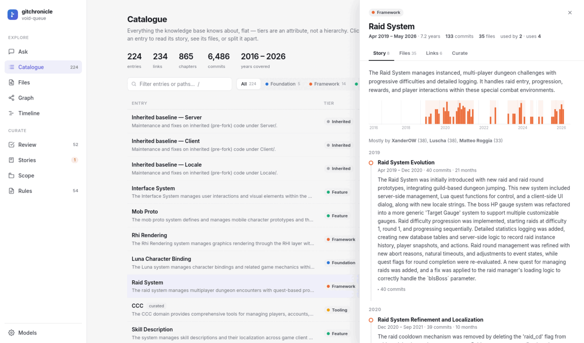
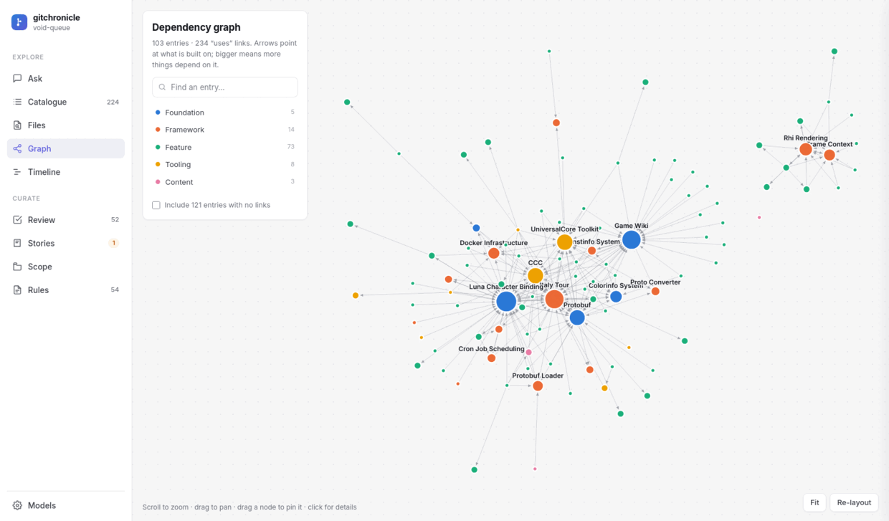
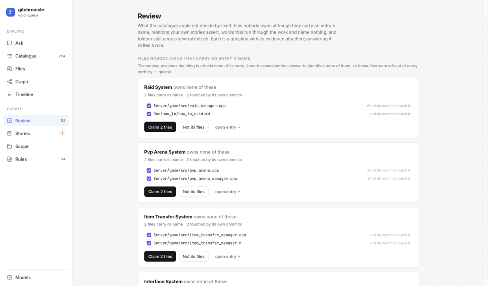

<p align="center">
  <picture>
    <source media="(prefers-color-scheme: dark)" srcset="docs/img/logo-wide-dark.svg">
    
  </picture>
</p>

**Turn a git repository into a knowledge base that answers questions about itself.** Not
what the code is *now* — every tool does that — but what was built, when, why, and what it
replaced. Years of commits become a catalogue of features, frameworks and tools, each with
its own dated story, its files, and what it is built on.

```
$ gitchronicle ask "how did the battle pass evolve?"
The battle pass was first built in May 2021 (`8bff020db2`), removed that August
(`fc5255f192`), and revived in 2024. It now ships seasonal content and is still
maintained — the last change is from June 2026.
```

The same knowledge base serves your editor's agent over MCP, a local studio for reading
and curating it, and static HTML + markdown you can publish.

<p align="center">
  
  <br><em>Every entry, with the story its own commits tell — chapters cut where the work
  actually turned, not every fortnight.</em>
</p>

---

## Install

```bash
python -m venv .venv && . .venv/bin/activate
pip install -e .          # add '[vertex]' for Google Vertex, '[dev]' to run the tests
```

Python ≥ 3.11 and `git`. No embedding server, no database server, no build step: one
SQLite file and one chat model.

## First run

```bash
cp config.example.toml config.toml     # set [repo].path, one [endpoints.*] and [roles.chat]
gitchronicle doctor                    # checks git, the repo and every model role
gitchronicle init                      # drafts the scope (what is the product); review it
gitchronicle cost --estimate 6500      # what the first build will cost, before it runs
gitchronicle update --chronicle        # build it: catalogue + narrated history
gitchronicle studio                    # read and curate it at 127.0.0.1:8765
```

A **6,574-commit, 15-year repository costs about $8 and 30 minutes**, narration included,
on Gemini 2.5 Flash with thinking off. A rebuild that finds nothing new makes **zero**
model calls, so `update` is safe to schedule. It untangles the newest commits first and
writes as it goes, so the last month is queryable minutes in.

## The commands

| | |
|---|---|
| `update` | ingest what is new and rebuild. `--chronicle` also narrates. The one to schedule |
| `init` | draft the scope map — which paths are the product — for you to review |
| `studio` | the local web app: ask, browse, graph, timeline, curate, narrate |
| `ask` | one question, answered with citations |
| `mcp` | serve the knowledge base to coding agents (stdio) |
| `doctor` | check git, the repository, the scope and every model role |
| `models` | where models live and which does which job; `--available` asks the endpoint |
| `cost` | what the runs cost, per stage; `--estimate N` before they run |
| `eval` | grade the answers against facts you already know |
| `ledger` | the curation file: draft one, or open it in `$EDITOR` |
| `inspect` | one file or one word: who owns it, **why**, what it was built for, what belongs with it. `"A -> B"`: the imports behind a link. `--unclaimed`: files nobody owns that carry an entry's name |

## What you get

- **A catalogue** — every feature, framework, tool and content area, with its files, its
  tier, when it was born and when it was last touched.
- **A story per entry** — chapters cut at real breaks in the work, narrated from the
  commits' own evidence, with the commits behind each one, and told plainly when the work
  stopped or the files went away.
- **A dependency graph** — what is built on what, from imports rather than guesses, plus
  the relations you state and minus the ones you judge wrong. Every link shows the
  references behind it, file by file.
- **Answers** — `gitchronicle ask`, citing entries and commits.
- **Exports** — `kb.html` and per-entry markdown, for reading or publishing.

<p align="center">
  
  <br><em>What is built on what, from imports rather than guesses — and every link opens
  into the references behind it.</em>
</p>

## Curation: the tool proposes, you decide

No tool can know that two directories are one framework while a third is one feature and
not three. So gitchronicle proposes a decomposition and you correct it in
`gitchronicle.plan`, a text file of rules over **paths** — which is why your corrections
survive re-runs and years of new commits:

```
entry "Scripting Runtime"
  claim  server/libscript/**
  reject scripting/protobuf/**                 # per-feature schemas belong to the features
  tier   framework
entry "Locale Strings"
  claim  locale/strings/** from "Quest Content" # take only that entry's files
merge  "Wiki Builder Tabs" -> "Wiki Manager"
reject "Constinfo System"                       # never propose it again
not-uses "Item System" -> "Locale Strings"      # not a relation: drop that link
keep-split client/ui/**                         # shared on purpose; stop asking
ignore raii                                     # a word that names nothing; stop asking
```

The **studio** is where this is comfortable. *Review* has three queues: folders the catalogue
split across several entries, **files nobody owns that carry an entry's name** — the
catalogue naming a thing while holding none of its code — and **words that run through the work and name no entry** —
the assembly's residue made visible, which is how a missing framework announces itself
rather than hiding in a log line. Each word can become an entry, be dismissed with
`ignore <word>`, or turn out to be a scope rule that is not taking effect. Beyond that, an
entry's *Files* tab lets you tick folders and assign them elsewhere, or search the whole
repository and pull files in; *Save & rebuild* applies it. Curation is free — replay costs
milliseconds and no model calls. Narration is the one paid action, so it has a place of its
own: **Stories** says how many entries have none, which ones, and what a run will spend
before it starts. Commits and stories follow
the files. Replay is pure, so re-graining costs milliseconds and no model calls. A full
example is in [`examples/ledger.plan`](examples/ledger.plan).

<p align="center">
  
  <br><em>Review is a queue of questions with their evidence attached. Here: entries whose
  code belongs to nobody — <code>raid_manager.cpp</code>, in 60 of Raid System's own
  commits, owned by nothing.</em>
</p>

### Files: surgical curation

The review queues look for work that is *unfiled*. A framework whose files are scattered
across seven entries is **misfiled**, and no queue can see it — every one of its files has
an owner. The studio's **Files** view works at that grain: search a path, a filename or a
word, and every match appears with whoever owns it today.

Where the matches import each other, it also splits them in two — the files the others
include (the framework) and the files that include them (its users) — as evidence, not a
verdict; which of the two you want is your call. Tick what belongs together, name it, and
the rules are written per source entry so each file is released from exactly the entry that
held it.

Clicking a path shows what it was built for (the work items behind it), which chapters tell
its story, and what changes with it. The same data is a command (`gitchronicle inspect
<path|word>`) and an MCP tool, so an agent can ask before it edits code.

The same search runs from inside an entry, so files come **in** as well as out: the rules
are written per source entry either way, and a file nobody owns is claimed outright.

*Measured*: a trait framework whose 8 files sat across 5 entries became one entry in a
single pass — search, tick, name, save. An entry that held three utility files took its
seven real ones, and the entry that had two of them released them, in one pass and 46
seconds of replay — no model calls.

### The gap neither queue can see

Those ask what is *unfiled* or *misfiled*. Neither can see a file that is simply
**absent**: the catalogue names the thing and holds none of its code. That happens for a
reason the tool is right about — a word several entries answer to identifies none of them,
so four entries carrying "affect" left `char_affect.cpp` (135 commits) to nobody — and the
refusal was silent. Review says it out loud, for every entry whose name a
file carries word for word, with how many of that entry's own commits touched it. On the
reference repository: 134 files, led by `raid_manager.cpp` (60 commits) and `pvp_arena.cpp`
(38), none of them owned by anything. `gitchronicle inspect --unclaimed` prints the same
list, and the `entry` MCP tool tells an agent about the ones under its nose.

### Why is this here?

Territory and links are inferred, so both can be wrong, and a conclusion you cannot
interrogate is one you cannot correct. Every file in an entry answers **why it is here** —
a rule you wrote, the work items filed under the entry that changed it, or its own name —
next to what it was built for and what it changes with. Every link opens into the
references that made it: *`SpotLightDebugPanel.cpp` → `dynamiclightmanager` →
`DynamicLightManager.cpp`*. If the answer is unconvincing, `not-uses` removes the link and
the next rebuild keeps it removed. The same two answers are a command and an MCP tool —
`gitchronicle inspect <path>` and `gitchronicle inspect "Debug Panel -> Rhi Rendering"` —
so an agent can weigh a link before believing it.

That view paid for itself immediately. A link from a server feature to the web admin panel
turned out to rest on `#include "config.h"` resolving to `config.js`: references were
matched by filename across the whole repository, with no notion of language. A reference
now resolves only to a file its own syntax could be naming, and only to one that still
exists — stated as an exclusion, so `.fx` including `.fxh`, or a `.forge` script requiring
a `.lua` library, keeps working. On the reference repository that removed **85 of 227
import edges**, and two of the six biggest "frameworks" turned out to be collisions.

### Scope: what is the product

`gitchronicle.md` holds the other half of curation — the **scope map**. Every path it
admits feeds the catalogue *and its vocabulary*, so leaving a vendored tree in has a cost
beyond noise: its words start to look like yours, and a feature named after one of them
never forms. On the reference repository a Boost tree left in scope accounted for 2,897 of
17,720 concerns and cost the catalogue a whole framework.

The studio's **Scope** view is a tree of the repository, one verdict per subtree:

| verdict | meaning |
|---|---|
| analysed | part of the product; clustered into entries |
| one entry | owned, but catalogued as ONE entry without decomposing it |
| external | somebody else's code; invisible to the analysis |

Each row shows its files, how much untangled work is attached to it and how much of it the
catalogue already owns, so the cost of a verdict is visible before you choose it. Marking a
tree external drops its evidence on the next rebuild; marking one analysed untangles it
(which costs). The view also reports rules that **do nothing** — an explicit `include:`
beats an `exclude:`, so a narrower exclusion written under a drafted include is silently
inert, and it will set the verdict in a way that actually takes effect.

The optional **Direction** section of the same file states glossary, grain rules and how
the narration should read.

## For agents: MCP

```bash
claude mcp add chronicle -- gitchronicle mcp --config /abs/path/config.toml
```

Five read-only tools: `search`, `entry` (its story, its links with the evidence for each,
and the files nobody owns that carry its name), `inspect` (a file: owner, *why* that entry
holds it, the work behind it, what changes with it — a word: every match with its owner and
framework-versus-users — or `"A -> B"`: the imports behind a link), `path_history` (which
entry owns a file and why it looks the way it does — worth calling before changing code)
and `period` (what happened in a given year). They return evidence, not conclusions; the
agent does its own reasoning.

## Models — the one thing you must configure

Everything else in gitchronicle is deterministic. **This is the entry point**, and the tool
brings no endpoint, no key and no vendor of its own. Two tables say everything: where models
live, and which one does which job.

```toml
[endpoints.mine]                     # WHERE models live
kind    = "openai"                   # sugar for an address — see the list below
api_key = "env:OPENAI_API_KEY"       # or file:/run/secrets/key

[roles.chat]                         # WHICH model does which job
model   = "gpt-4o-mini"
```

That is a complete configuration: one endpoint, one model, every job. `gitchronicle models`
prints what it resolved, `gitchronicle doctor` checks it answers.

### Endpoints: any endpoint

An endpoint is three things — a **protocol**, an **address**, and how to **authenticate**:

```toml
[endpoints.work]
protocol = "openai"                  # openai | anthropic | ollama — the only three
base_url = "https://api.groq.com/openai/v1"
auth     = "bearer"                  # bearer | header:x-api-key | query:key | adc | none
api_key  = "env:GROQ_API_KEY"
dialect  = "openai"                  # how this endpoint spells "think less"
```

`kind` fills those in for an address we happen to know — **openai, gemini, vertex,
anthropic, ollama, azure, groq, together, openrouter, scaleway, deepinfra, fireworks,
mistral, xai, deepseek, llamacpp, lmstudio, vllm, litellm** — and it is *data, never a code
path*. A vendor nobody here has heard of is the four fields above, written out; there is
nothing to wait for and nothing to patch. For a provider that speaks no protocol in that
list, point an endpoint at a **LiteLLM or OpenRouter proxy** — that is the OpenAI protocol,
and it costs this project no maintenance at all.

### Roles: five jobs, and they can each live somewhere else

| role | what it does | how much it runs |
|---|---|---|
| `chat` | the default — every job that names no model of its own | — |
| `untangle` | one call per commit: what changed and why | **the bulk of the bill** |
| `naming` | the names in your catalogue | pin it: changing it renames everything |
| `narration` | the stories (`update --chronicle`, studio → Stories) | modest |
| `answer` | answering questions: `ask`, and the studio | a few calls, the slow ones |
| `judge` | grading in `eval` — worth a *different* model from the one that answered | only when you evaluate |

Each falls back (`untangle`/`naming`/`narration`/`answer` → `chat`; `judge` → `answer`), so
you add a role only when you want that job to differ. A local model for the thousands of
untangle calls and a frontier model for the handful of answers is a normal setup, and it is
stated once per endpoint rather than once per role:

```toml
[endpoints.local]
kind = "ollama"

[endpoints.work]
kind    = "openai"
api_key = "env:OPENAI_API_KEY"

[roles.chat]
endpoint = "work"
model    = "gpt-4o-mini"

[roles.untangle]
endpoint = "local"
model    = "qwen2.5-coder:14b"
think    = "off"
```

### Thinking: one setting, every vendor's spelling

```toml
think = "off"        # or a token budget (128, 1024), or "low" | "medium" | "high"
```

gitchronicle writes what *that* endpoint understands — a `thinking_config` budget for
Gemini and Vertex, `reasoning_effort` for OpenAI and everything speaking its protocol,
`thinking.budget_tokens` for Anthropic, `think: false` for Ollama. Reasoning is billed as
**output** and is most of the wait:

| | latency of one answer |
|---|---|
| `gemini-2.5-pro`, thinking as it comes | 13.4 s |
| `gemini-2.5-pro`, `think = 128` | 5.1 s |
| `gemini-2.5-flash`, `think = "off"` | 2.9 s |

and on the pipeline it was **52% of all untangle tokens** for nothing the eval could see:
6,574 commits went from $30 and ~5 h to **$7.51 and 30 min**. Some models refuse to be
silenced entirely (`gemini-2.5-pro` rejects `off`); cap them instead.

### Without touching a file

```bash
gitchronicle --model answer=gpt-4o-mini --think answer=off ask "when did X ship?"
gitchronicle --endpoint untangle=local --model untangle=qwen2.5-coder:14b update

# no config file at all — enough for a CI job or an agent host
GITCHRONICLE_KIND=openai GITCHRONICLE_API_KEY=sk-… GITCHRONICLE_MODEL=gpt-4o-mini \
  gitchronicle update
```

`--model`, `--think` and `--endpoint` take `ROLE=VALUE`, are repeatable, and work on every
command. The environment equivalents are `GITCHRONICLE_<ROLE>_MODEL|THINK|ENDPOINT`, plus
`GITCHRONICLE_KIND|BASE_URL|API_KEY|MODEL` for a whole configuration with no file.
**MCP needs no model at all** — the server is read-only SQL over the knowledge base, so an
agent host mounts no credentials to run it.

### Credentials

| written as | means |
|---|---|
| `"sk-…"` | the key itself, in the file |
| `"env:OPENAI_API_KEY"` | read from the environment, or a `.env` beside your config, at startup |
| `"file:/run/secrets/openai"` | read from a file — docker/k8s secrets, agent hosts |

`auth = "adc"` uses Google Application Default Credentials and takes no key — the studio
asks for a GCP project instead, and its test mints a token rather than listing models.

Nothing here ever logs or caches a key: `doctor`, `models` and the studio show where it came
from (`env:OPENAI_API_KEY`), and a key given literally is shown as `set, not shown (…1234)`.
**A key you type in the studio is written to the `.env` beside your config** (mode 0600,
already git-ignored, already loaded) and the config file keeps only
`api_key = "env:NAME"` — so the config stays safe to share or commit.

### In the studio

**Models**, at the foot of the rail, is the whole setup in two steps, and needs no text
editor:

1. **Connect an endpoint** — pick a provider (the address fills itself in), paste a key or
   give a GCP project, and press **test**: it asks the endpoint what models it can run, or
   mints an ADC token, and tells you what came back.
2. **Say which model does which job** — each role picks an endpoint and a model from that
   list, with its thinking setting and its own test button.

Saving writes `[endpoints]` and `[roles]` into your config file line by line — comments and
every other section untouched — and the key into the `.env` beside it. The next question
uses it without a restart.

- **Anything else your endpoint accepts** goes through `headers`, `query` and `params` in
  the endpoint block, without waiting for a release.

## Checking the answers

`gitchronicle eval` asks questions whose answers you already know and grades each answer
fact by fact, sampling every question several times:

```json
[{"q": "When was the battle pass first removed?", "facts": ["August 2021"]},
 {"q": "When was VR support added?", "facts": ["there is none"], "unanswerable": true}]
```

It scores 96% on [alacritty](https://github.com/alacritty/alacritty) (2,493 commits of
Rust, built in 13 minutes), 90% on a 15-year private fork and 83% on
[httpie](https://github.com/httpie/cli); both public question sets ship in
[`eval/`](eval/).
[The numbers, and what they cost](docs/measurements.md).

## Privacy

The knowledge base holds your repository's commit messages, file paths and **author names
and email addresses**; so do the exported dossiers and `kb.html`. Everything stays on your
machine except what goes to your model provider — commit messages, diffs and file paths.
Worth checking before pointing it at a private codebase, and before publishing an export.

## Limits

- The decomposition was tuned on one repository. Elsewhere it is weaker, and the *answers*
  hide it: alacritty scores 96% on questions while a third of its entries are named after
  directories and its dependency graph has 8 links. Expect to curate names and territory on
  a repository the tool has not seen.
- Un-curated entries re-cluster as history grows. That is why curation lives in rules over
  paths rather than in the database.
- Narration is grounded in each commit's own evidence but not verified sentence by
  sentence.
- Linux is the only tested platform.

[How it works](docs/architecture.md) · [what was measured](docs/measurements.md) ·
[contributing](CONTRIBUTING.md) · [changelog](CHANGELOG.md)

## License

MIT — see [LICENSE](LICENSE).
